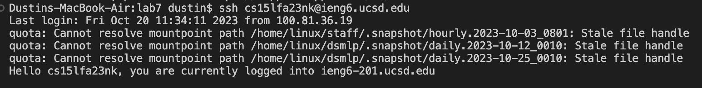
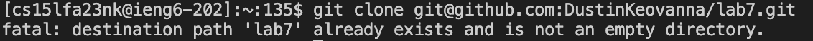
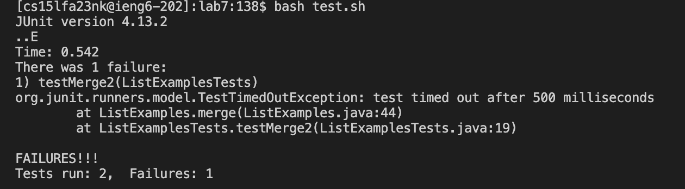
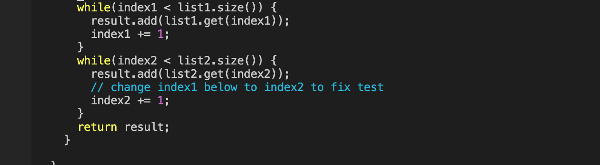
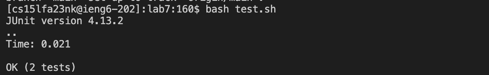
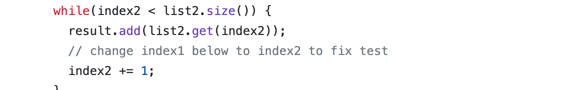
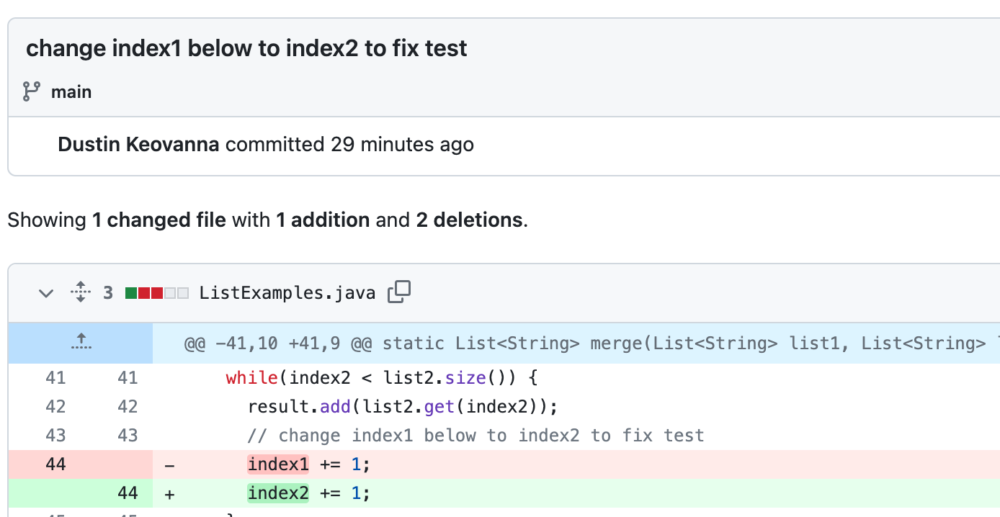

# Lab Report #4 - Vim

## Keys Pressed:
* "ssh cs15lfa23nk@ieng6.ucsd.edu" 
* ```<enter>```
*

*
"git clone git@github.com:DustinKeovanna/lab7.git ```<enter>```
(unfortunately, I already used the command, so I can't show the cloning in the terminal) 

"bash test.sh" ```<enter>```

"vim ListExamplesTests.java" ```<enter>```
Press j 44 times Press e3 Press l Press i press backspace press 2 press :wq

"git add ListExamples.java"
```<up> <up> <enter>``` (The bash test.sh command was up 2 in the search history, so I used the up arrow to access it)

 git commit -m "changed index1 below to index2", git push -u origin main,
 
