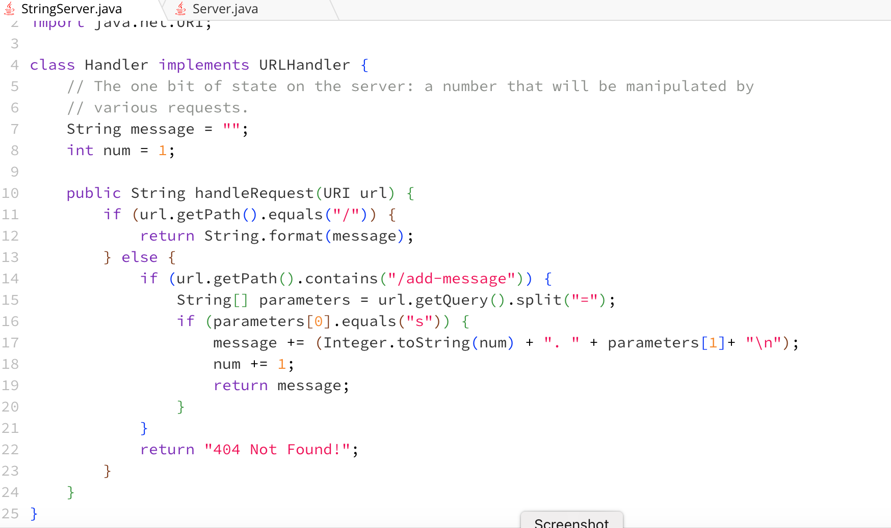
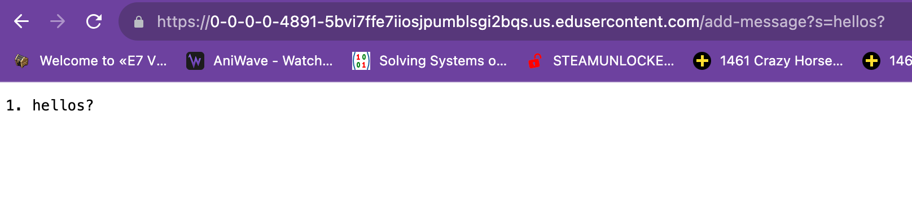
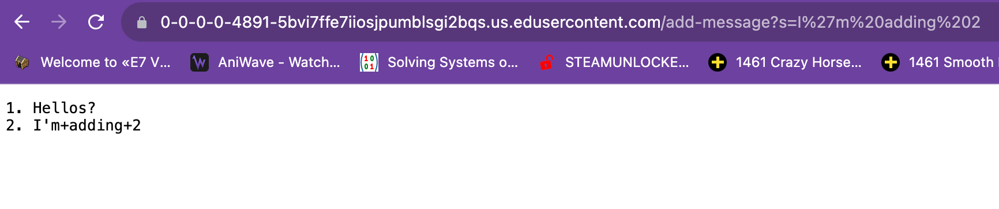
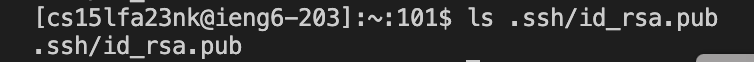
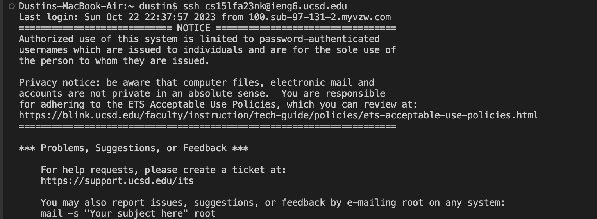

# Lab Report #2
For my 2nd lab report, I'll show the code I launched on my web browser, ```StringServer.java```. I'll also showcase the paths to my private and public keys.

## The StringServer web browser
Here's an image of the code I used for the ```StringServer.java``` web browser.

---
 
For image 1, the method I used was handlerequest. 

The relevant argument is a URL and checks if it contains ```/add-message```. If it does The message is added to a string array and returned to the browser. The Variable, ```Message``` is returned and the value is the previous message with the string formatted int of ```num```. 

The values do not change or differ, because the argument converts the input into a string, regardless of if it is an int or double.


For image 2, the method I used was handlerequest. 

The relevant argument is a URL and checks if it contains ```/add-message```. If it does The message is added to a string array and returned to the browser. The Variable, ```Message``` is returned and the value is the previous message with the string formatted int of ```num```.

The values do not change or differ, because the argument converts the input into a string, regardless of if it is an int or double.


## Part 2
For public key:
/Users/dustin/.ssh/id_rsa.pub


For private key:
/Users/dustin/.ssh/id_rsa


Proof of using the login without a password prompt.


