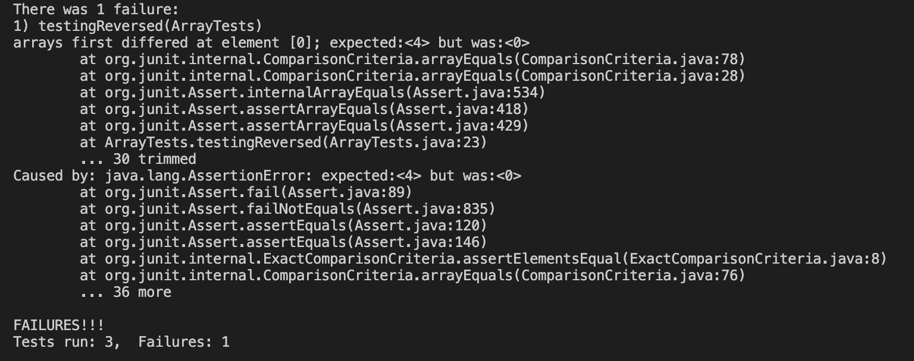
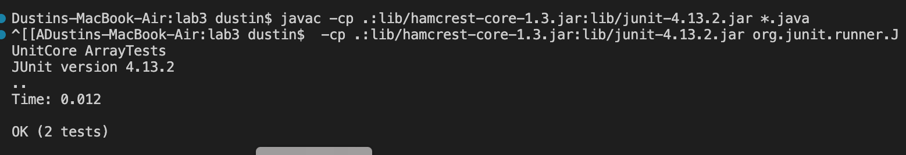

# Lab Report #3

## Part 1 bugs
* A test case where it's expected to fail and show the bugginess of the code.
```
public class ArrayExamples {
  // Returns a *new* array with all the elements of the input array in reversed
  // order
  static int[] reversed(int[] arr) {
    int[] newArray = new int[arr.length];
    for(int i = 0; i < arr.length; i += 1) {
      arr[i] = newArray[arr.length - i - 1];
    }
    return arr;
  }
}
@Test
  public void testingReversed() {
    int[] input1 = {2,5,4};
    int[] input2 = {4,5,2};
    assertArrayEquals(new int[]{4,5,2}, ArrayExamples.reversed(input1));
  }
```
* A test case where it's expected not to fail the code.                                                                     
```
public class ArrayExamples {
  // Returns a *new* array with all the elements of the input array in reversed
  // order
  static int[] reversed(int[] arr) {
    int[] newArray = new int[arr.length];
    for(int i = 0; i < arr.length; i += 1) {
      arr[i] = newArray[arr.length - i - 1];
    }
    return arr;
  }
}
@Test
  public void testReversed() {
    int[] input1 = { };
    assertArrayEquals(new int[]{ }, ArrayExamples.reversed(input1));
  }
```
* A symptom: the output on the terminal from running the test case is expected to crack the code.

The output that should fail.


* Compiling the code where there are no failures


* Before and after showcases of fixing the bug in the code
Before:
```
public class ArrayExamples {
// Returns a *new* array with all the elements of the input array in reversed
// order
static int[] reversed(int[] arr) {
  int[] newArray = new int[arr.length];
  for(int i = 0; i < arr.length; i += 1) {
    arr[i] = newArray[arr.length - i - 1];
  }
  return arr;
  }
}
```
After:
```
public class ArrayExamples {
// Returns a *new* array with all the elements of the input array in reversed
// order
static int[] reversed(int[] arr) {
  int[] newArray = new int[arr.length];
  for(int i = 0; i < arr.length; i += 1) {
    newArray[i] = arr[arr.length - i - 1];
  }
  return newArray;
  }
}
```
The problem with the original code was that we were changing the original array by attempting to copy the empty ```newArray``` while also trying to return the original array when we should be returning a new array. The new code should fix the bug because we're now returning the newArray while copying the contents of the original array.

## Part 2 - Researching Commands
I will use grep as my command

### -r
*
```
Dustins-MacBook-Air:biomed dustin$ grep -r "Darwin" *.txt
1471-2105-3-2.txt:        In the 1830's, Charles Darwin's investigation of the
1471-2105-3-2.txt:        In the 1970's, Woese and Fox revisited Darwinian
```
*
```
Dustins-MacBook-Air:government dustin$ grep -r "Clinicians" Alcohol_Problems
Alcohol_Problems/Session2-PDF.txt:endpoints we are measuring. Clinicians in the ED are interested in
Alcohol_Problems/Session2-PDF.txt:Clinicians often use their general impression to help with
```

If you want to look for a specific word while in a directory tree, use the -r command. The -r command takes in a word and looks for its every occurrence within text files from the directory and/or subdirectories.

### grep -i 
*
```
Dustins-MacBook-Air:technical dustin$ grep -i "Mr. Annan" */journal.pbio.0020001.txt
        the world scientific community closer to each other (Annan 2003). Mr. Annan stressed the
        development itself.” Indeed, Mr. Annan's sentiments have also been echoed recently by
        developing worlds actually remaining unchanged or even increasing, as Mr. Annan has
        to travel, we feel optimistic that the bridges mentioned by Mr. Annan are slowly being
```
*
```
Dustins-MacBook-Air:government dustin$ grep -i "priority" */Gleiman_EMASpeech.txt
over-the-counter retail parcels into Priority Mail. The price
differential between Priority Mail and single piece parcels is very
package Priority, and, if the individual purchases delivery
Priority Mail service! Faster service at a lower price means
Priority and Parcel Post. The USPS has proposed extending this
```
grep -i is somewhat similar to grep -r, where both commands take in a word and look for its every occurrence. Grep -i differs by printing the entire line the word appears in. This command is useful when you want to have some sort of understanding of the text you're looking at.

### grep -c
*
```
Dustins-MacBook-Air:911report dustin$ grep -c "Thumairy" ./chapter-7.txt
11
```
*
```
Dustins-MacBook-Air:technical dustin$ grep -c "develop" */journal.pbio.0030021.txt   
15
```
grep -c counts every line the word appears in a text file. You could use this command to get an idea of how common the word appears in a file.

###  grep -l
*
```
Dustins-MacBook-Air:biomed dustin$ grep -l "ecology" *.txt   
1471-2180-3-4.txt
1471-2458-2-25.txt
1472-6785-1-3.txt
1472-6785-1-5.txt
1472-6785-2-6.txt
1472-6785-2-7.txt
1472-6874-2-13.txt
1475-2875-1-14.txt
1476-4598-2-24.txt
```
*
```
Dustins-MacBook-Air:Media dustin$ grep -l "immigrant" *.txt   
Aid_Gets_7_Million.txt
Barr_sharpening_ax.txt
RoanokeTimes.txt
The_State_of_Pro_Bono.txt
Understanding.txt
Unusual_Woodburn.txt
Using_Tech_Tools.txt
Workers_aid_center.txt
```

This command looks within directories and outputs every file that contains the keyword. This command is useful when you're looking for a word and want to collect every file that contains the word.

I used geeksforgeeks.org[Geeksforgeeks.org](https://www.geeksforgeeks.org/grep-command-in-unixlinux/) to help write my descriptions of the grep commands.
