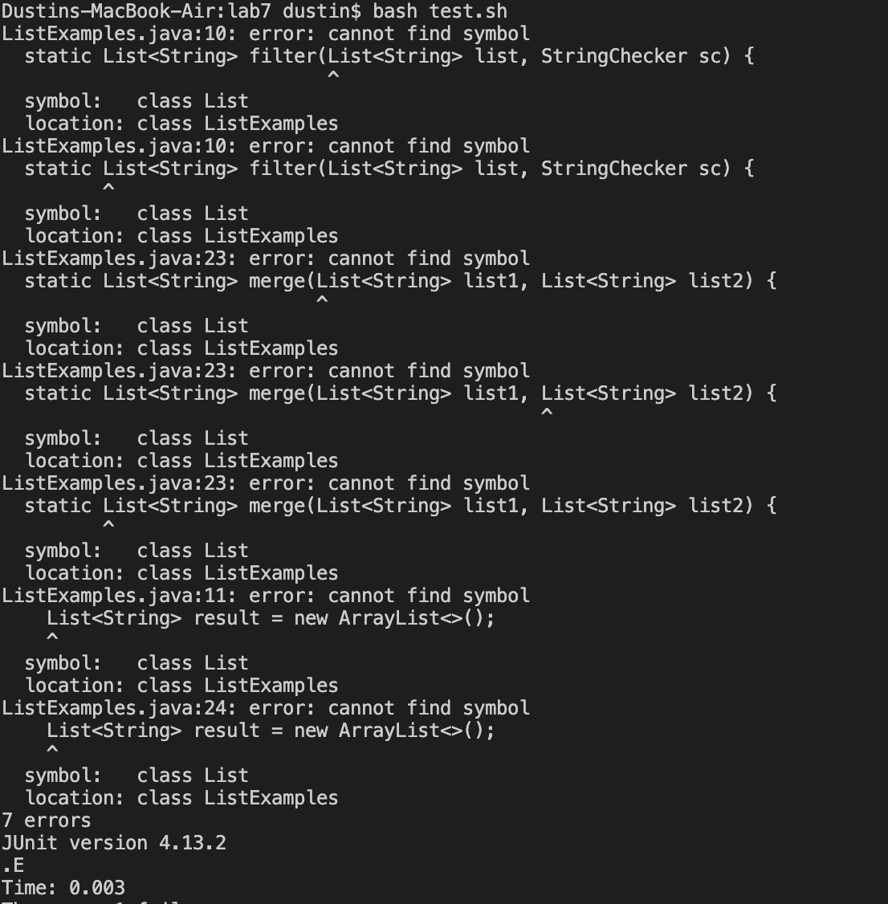

# Lab Report #5 - Putting it All Together

**Anonymous:**
I just forked the lab7 directory and should've fixed the ```merge``` method bug by changing ```index1``` to ```index2``` in the last while loop, but it seems like I have a totally different error than I what I had before. I don't think I changed anything else and the only command I typed in the terminal after editing ```ListExamples.Java``` file was ```bash test.sh```. I created 2 extra test cases for a total of 4, but only 1 test was run so I think the error might stem from either the ```ListExamples.Java``` file or the bash script. What should I do, the bash script mostly looks correct so it has to be the ```ListExamples.Java``` file right? 

The commands I ran:
* ```bash test.sh```
(Screenshot of my terminal below)
 

