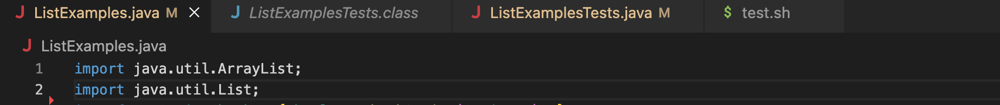
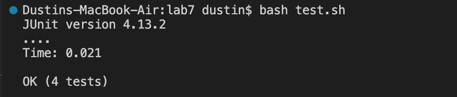

# Lab Report #5 - Putting it All Together

**Anonymous:**
I just forked the lab7 directory and should've fixed the ```merge``` method bug by changing ```index1``` to ```index2``` in the last while loop, but it seems like I have a totally different error than I what I had before. I don't think I changed anything else and the only command I typed in the terminal after editing ```ListExamples.Java``` file was ```bash test.sh```. I created 2 extra test cases for a total of 4, but only 1 test was run so I think the error might stem from either the ```ListExamples.Java``` file or the bash script. What should I do, the bash script mostly looks correct so it has to be the ```ListExamples.Java``` file right? 

The commands I ran:
* ```bash test.sh```
(Screenshot of my terminal below)
 

Here's also a pic of my file structure with each screenshot of a file:


ListExamples.Java
 

test.sh


**Joe Paulina:**
In the 2nd image of your terminal that you shared, on the 3rd line, it says "Could not find class [ListExamplesTests.class]". Looking back to your bash test script, do you remember what the last parameter of the JUnit test runner looks for?

**Anonymous:**
it should ask for the class of the tests I wanna run, which is what I copied and pasted from the file directory.

**Joe Paulina:**
That's totally correct, if the command is already looking for a class file within your directory, do you need to specify the ```.class``` in the command? try running the terminal again.

**Anonymous:**

 I removed the ```.class``` in the 2nd line and ran the terminal again, and it seems like all of the tests were able to compile. This shows that the bug I had was in the bash script where the JUnit runner couldn't find the correct class of the test cases. I had the file but named it incorrectly.
 
The image above shows my tests compiling correctly but I still have the errors running above. I'm completely lost with how I could fix ```ListExamples.Java```

**Joe Paulina:**
Interesting, in the 1st image you shared, I see multiple occurrences of "**cannot find symbol**" related to the "List" class. This usually means there's a package missing, that's not allowing you to use the "List" class. In the ```ListExamples.Java``` file, have you used any other class besides the "ArrayList" that you would have wanted to be imported?

**Anonymous:**
I noticed I also use the "List" class type, so I think I would add the line, "java.util.List" as well.
 

**Anonymous:**
Amazing! My terminal doesn't show an error anymore after running ```bash test.sh``` again.
 

